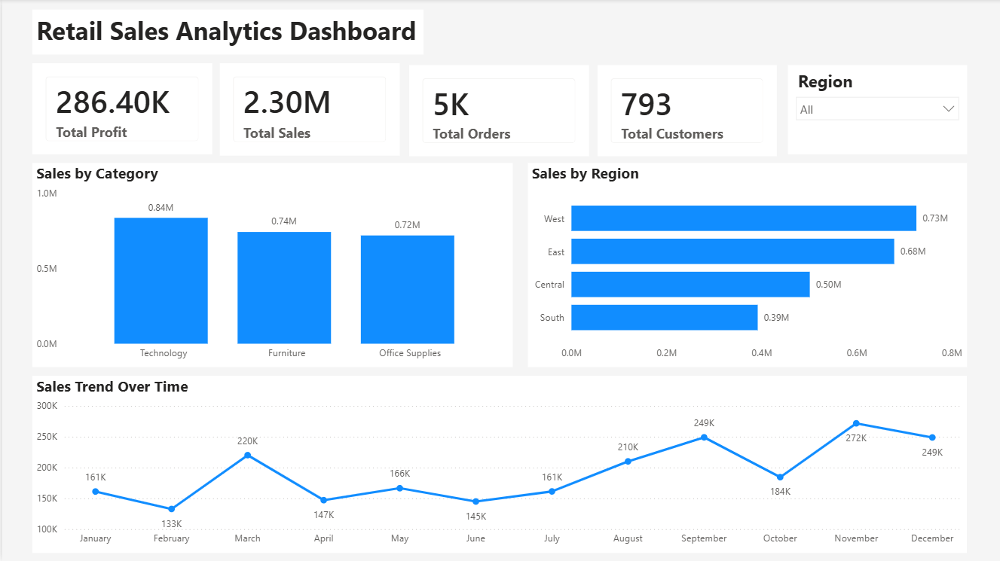
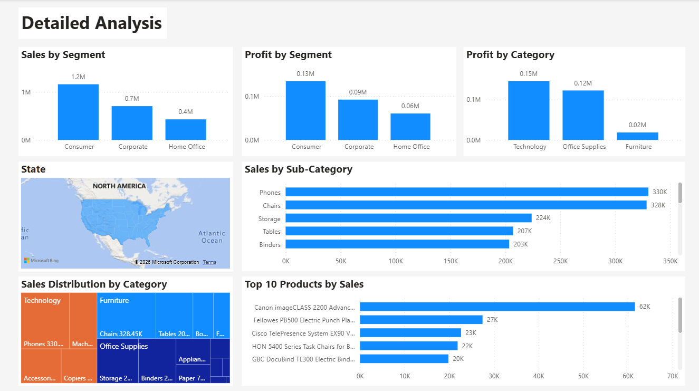

# Retail Sales Analytics Dashboard

## Overview

This project analyzes retail sales data using SQL, Python, and Power BI to uncover business insights related to sales, profit, customers, products, and regional performance.

The project follows a complete analytics workflow:

- Data Cleaning & Exploration
- SQL Business Queries
- Exploratory Data Analysis (Python)
- Interactive Dashboard Development (Power BI)

---

## Dataset

- **Dataset:** Sample Superstore
- **Records:** 9,994
- **Features:** 21
- **Domain:** Retail Sales

---

## Technologies Used

- Python
- Pandas
- Matplotlib
- SQL (MySQL)
- Power BI
- Git
- GitHub

---

## Project Structure

```
Retail-Sales-Analytics/
│
├── dashboard/
│   └── Sales_Analytics_Dashboard.pbix
│
├── data/
│   └── Sample-Superstore.csv
│
├── images/
│   ├── executive_dashboard.png
│   └── detailed_analysis.png
│
├── notebooks/
│   └── retail_analysis.ipynb
│
├── sql/
│   └── retail_sales_queries.sql
│
├── README.md
└── requirements.txt
```

---

## Project Workflow

### 1. Data Cleaning & Exploration

- Loaded dataset using Pandas
- Checked missing values
- Verified data types
- Performed exploratory data analysis
- Generated summary statistics

---

### 2. SQL Analysis

Performed SQL queries to answer business questions such as:

- Total Sales
- Total Profit
- Top Selling Products
- Top Customers
- Regional Performance
- Category-wise Sales
- Monthly Sales Trend

---

### 3. Python Exploratory Data Analysis

Created visualizations including:

- Sales by Category
- Profit by Category
- Sales Trend
- Regional Analysis
- Customer Analysis

---

### 4. Power BI Dashboard

Developed two interactive dashboards:

### Executive Dashboard

- KPI Cards
- Sales by Category
- Sales by Region
- Monthly Sales Trend
- Region Filter

### Detailed Analysis Dashboard

- Sales by Segment
- Profit by Segment
- Profit by Category
- Filled Map (State-wise)
- Sales by Sub-Category
- Sales Distribution Treemap
- Top 10 Products by Sales

---

## Key Insights

- Technology generated the highest sales.
- Consumer segment contributed the highest revenue and profit.
- West region recorded the highest sales.
- Phones and Chairs were among the top-selling sub-categories.
- Furniture generated high sales but comparatively lower profit.
- Office Supplies showed consistent performance across multiple products.

---

## Dashboard Preview

### Executive Dashboard



---

### Detailed Analysis Dashboard



---

## Skills Demonstrated

- Data Cleaning
- Data Analysis
- SQL Querying
- Exploratory Data Analysis
- Data Visualization
- Dashboard Design
- Business Intelligence
- Power BI
- Git & GitHub

---

## Future Improvements

- Sales Forecasting
- Customer Segmentation
- Profit Prediction
- Inventory Analysis
- Automated Dashboard Refresh

---

## Author

**Harsh Tharani**

B.Tech Electrical Engineering  
Delhi Technological University (DTU)